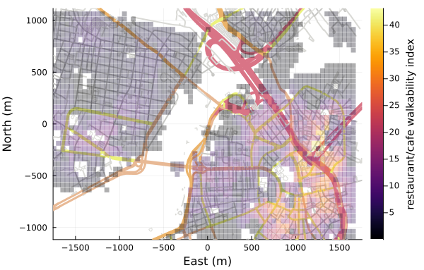

# Visualization

## How to visualize the data

The library can be integrated with various vizualisation frameworks. Below we show two example codes that can be a base for further exploration. The first example uses `folium`  via `PythonCall` (`using CondaPkg; CondaPkg.add_channel("conda-forge"); CondaPkg.add("folium")`) while the second example uses `Plots.jl` combined with [`OpenStreetMapXPlot.jl`](https://github.com/pszufe/OpenStreetMapXPlot.jl).


### Point of interest with Python folium via PyCall

Below is a sample piece of code that can be used to generate a visualization of POIs on a map.
```julia
using PythonCall, Colors, OSMToolset

file = sample_osm_file()
df = find_poi(file)
ix = AttractivenessSpatIndex(df);

flm = PythonCall.pyimport("folium");

colrs = distinguishable_colors(length(ix.measures), [RGB(0.1,0.2,0.4)])
class2col =  Dict(ix.measures .=> colrs);

m = flm.Map(tiles = "Cartodb Positron")
line = 0

for row in eachrow(df)
    line += 1
    info = "$(row.group):$(row.key)=$(row.value)"

    k = findfirst(==(Symbol(row.group)), ix.measures)
    flm.Circle((row.lat, row.lon), color="#$(hex(colrs[k]))",radius=row.influence,
        fill_color="#$(hex(colrs[k]))", fill_opacity=0.06, tooltip=info).add_to(m)

end
bb = getbounds(file)
bounds = ((bb.minlat, Float64(bb.minlon)), (bb.maxlat, Float64(bb.maxlon)))
m.fit_bounds(bounds)
flm.Rectangle(bounds, color="blue",weight=2).add_to(m)

m
```
The obtained result should be similar to the picture below.


### Buidling walkability index and vizualisation with OpenStreetMapXPlot

In this example we download a map from the Overpass API.
Next,

```julia
using Pkg
using OSMToolset
using DataFrames
using Plots
using OpenStreetMapX, OpenStreetMapXPlot

# downloading a fragment of Boston map from the Overpass API
f = download("https://overpass-api.de/api/map?bbox=-71.0912,42.3550,-71.0486,42.3751")
mv(f, "Boston.osm")

""" Prepares data for plotting for a given map data and a set of POIs """
function getplotdata(md, dfpoi)

    # All ENU coordinates should have the same reference point
    refLLA = OpenStreetMapX.center(md.bounds)

    enus = ENU.(LLA.(dfpoi.lat, dfpoi.lon), Ref(refLLA))
    x = getX.(enus)
    xmin, xmax = minimum(x), maximum(x)
    y = getY.(enus)
    ymin, ymax = minimum(y), maximum(y)


    # index for efficient spatial queries for nodes
    ixnodes = NodeSpatIndex(md, refLLA; node_range=150.0)

    # index for efficient spatial queries for poi availability
    # pois requiring a walk beyond 350m are not considered
    ixpoi = AttractivenessSpatIndex{NoneMetaPOI}(dfpoi, refLLA; get_range=a->350, get_group=a->:poi);

    """ Calculates the distance between a given coordinate and a POI location"""
    function mydistance(enu1, enu2)
        OpenStreetMapX.distance(enu1, enu2) > 700 && return Inf
        dist1, node1 = findnode(ixnodes, LLA(enu1, refLLA))
        dist2, node2 = findnode(ixnodes, LLA(enu2, refLLA))
        if dist1 > 150 || dist2 > 350 # points off the road grid
            return Inf
        end
        dist1 + OpenStreetMapX.shortest_route(md, node1, node2)[2] + dist2
    end

    cellsize = 50  # size of a box in meters
    attdf = DataFrame()

    # In order to speed-up the computations we parallelize this loop (run Julia with the -t paramater)
    lock = Threads.ReentrantLock()
    Threads.@threads for i in 0:round(Int, (xmax - xmin) / cellsize)
        for j in 0:round(Int, (ymax - ymin) / cellsize)
            enu = ENU(xmin + i*cellsize, ymin + j*cellsize)
            att = attractiveness(ixpoi, enu; distance=mydistance,
                calculate_attractiveness=(_, poidist) -> max(0.0, (750 - poidist) / 750))
            if att.poi > 0
                Threads.lock(lock) do
                    push!(attdf,(;x=getX(enu), y=getY(enu), att=att.poi))
                end
            end
        end
    end
    return attdf
end

md = get_map_data("Boston.osm"; use_cache=false, only_intersections=false);
config = DataFrame(key="amenity", values=["restaurant", "fast_food", "food_court", "pub", "bar", "cafe", "ice_cream"])
dfpoi = find_poi("Boston.osm"; scrape_config=ScrapePOIConfig{NoneMetaPOI}(config))


attdf = getplotdata(md, dfpoi)

scatter!(plotmap(md), attdf.x, attdf.y;zcolor=attdf.att, legend=false, colorbar=true, markershape=:rect, markeralpha=0.32,markerstrokewidth=0,markersize=3.45, colorbar_title="restaurant/cafe walkability index")
```


